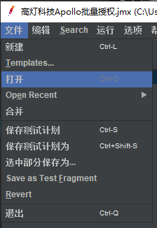
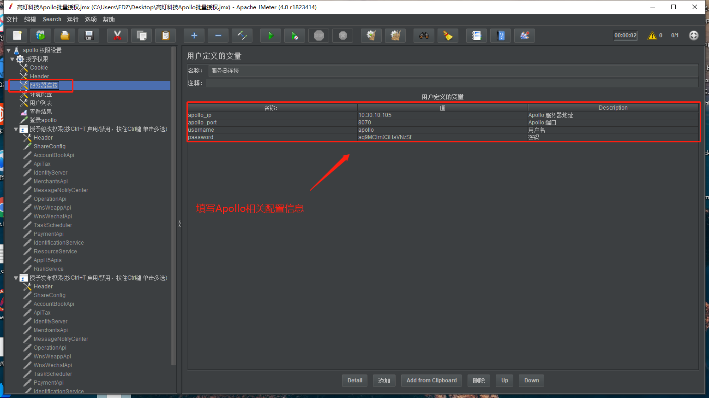
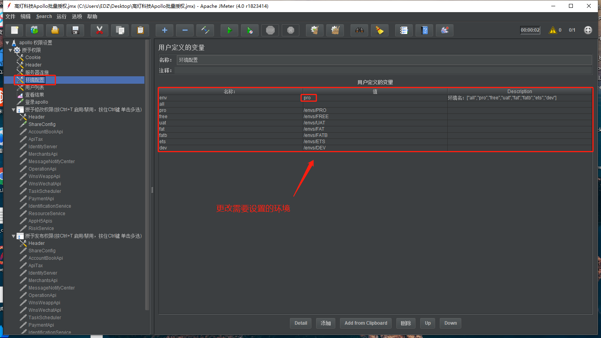
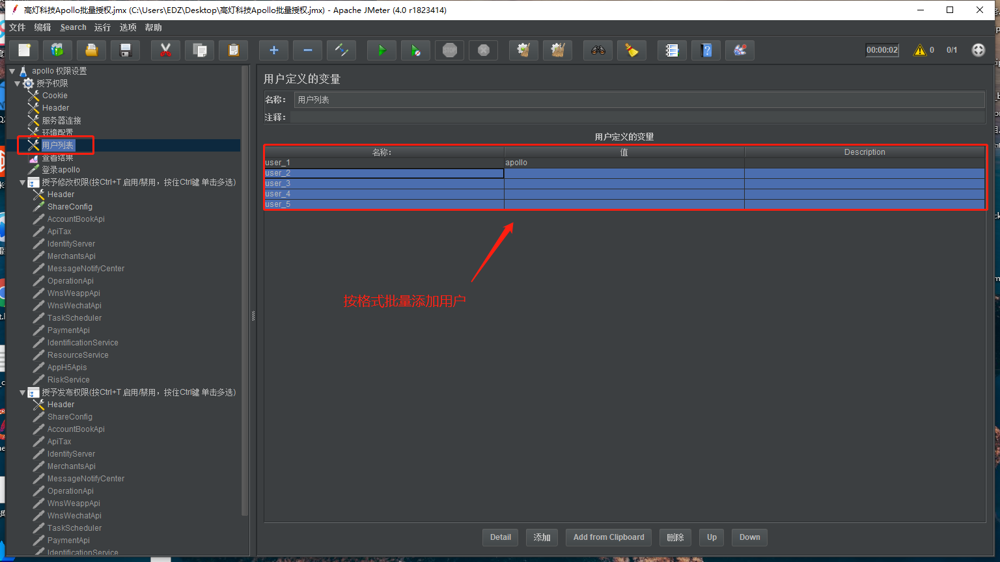
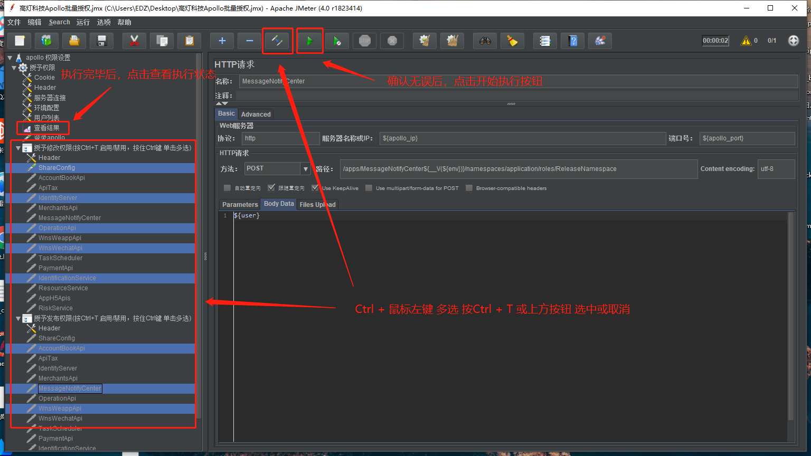

# 一、环境&工具

1.Java: [点击下载](https://wetax-resources-1258944054.cos.ap-guangzhou.myqcloud.com/java/jdk-8u231-windows-x64.exe)  
2.Jmeter: [点击下载](https://wetax-resources-1258944054.cos.ap-guangzhou.myqcloud.com/jmeter/jmeter-4.0.zip)  

# 二、开始使用
## 启动Jmeter
双击运行bin目录下的jmeter.bat 脚本文件

## 打开工程文件
【文件】-> 打开 打开 高灯科技Apollo批量授权.jmx  
  
## 配置Apollo
  
  
  
  